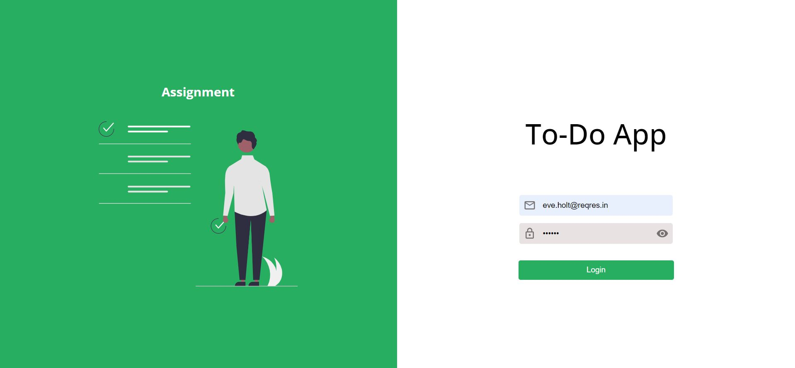
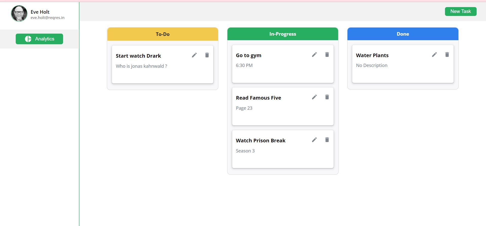
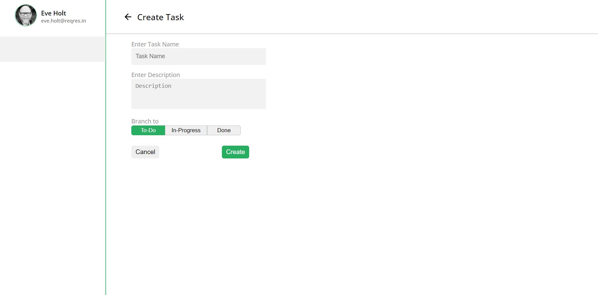
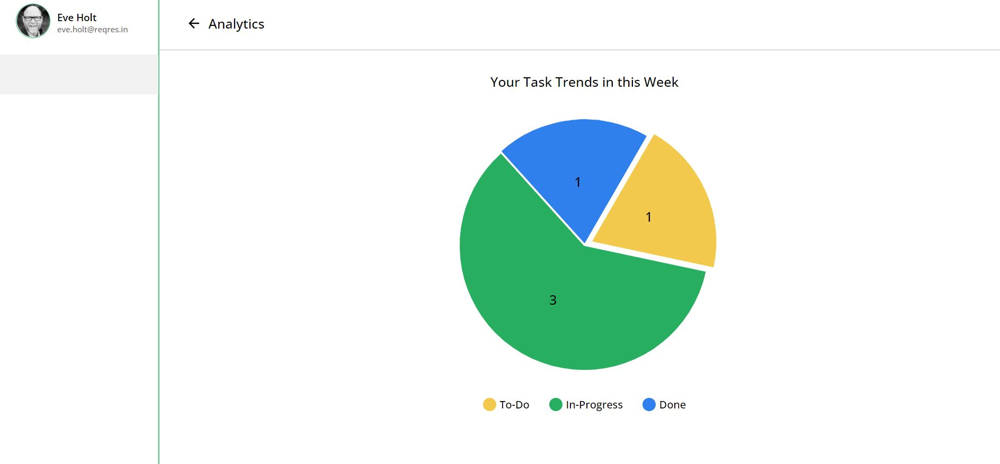

# Todo Application

#### A react application which can be used to create tasks and manage reminders for the tasks. 

#### This application has three sections : "Todo", "In-Progress" and "Done". User can drag and drop tasks from one section to another.

### Demo of the application can be found here: [https://todo-app-switchon.netlify.app/](https://todo-app-switchon.netlify.app/)

## To run the application in your local system

- Make sure you have [NodeJS](https://nodejs.org/en/download/) installed.
- Open command promt and run the following commands

### `npm install`

This is insall all the requied packages to run the application.

### `npm start`

Thhis command runs the app in the development mode.\
Open [http://localhost:3000](http://localhost:3000) to view it in your browser.

The page will reload when you make changes.\
You may also see any lint errors in the console.

## Screenshots of the application

| ||
|-|-|
| ||
